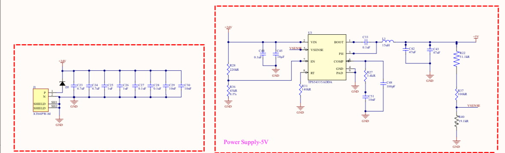
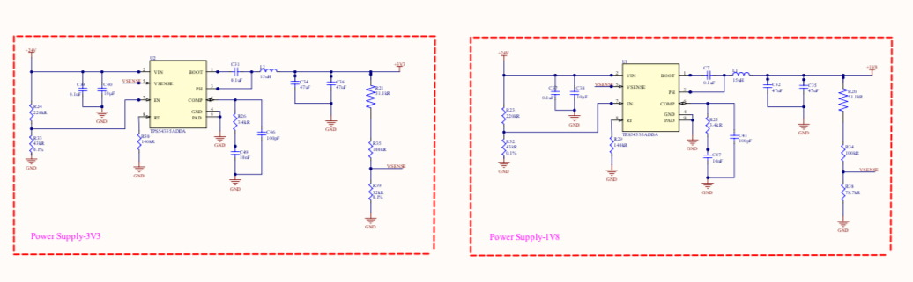
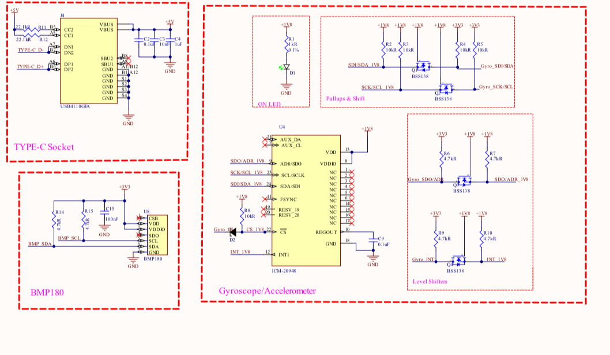
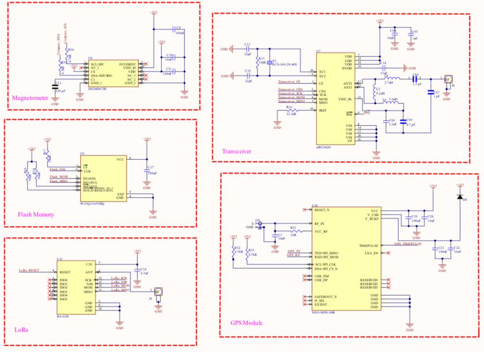
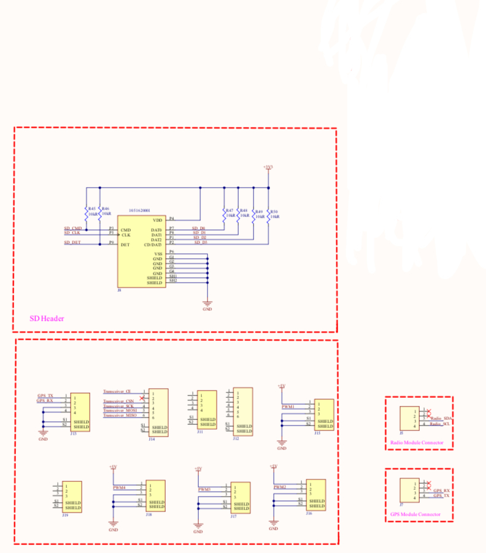
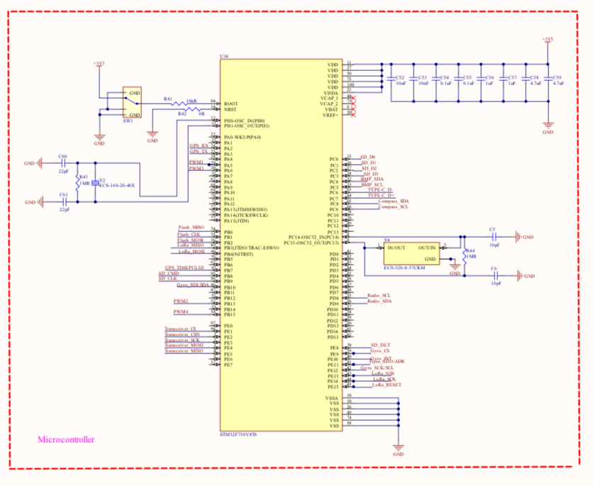
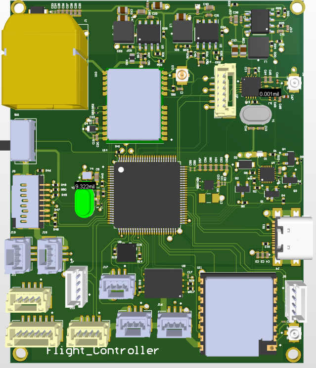
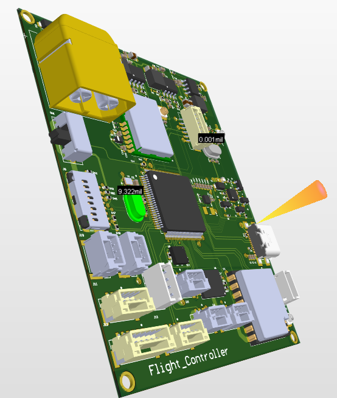
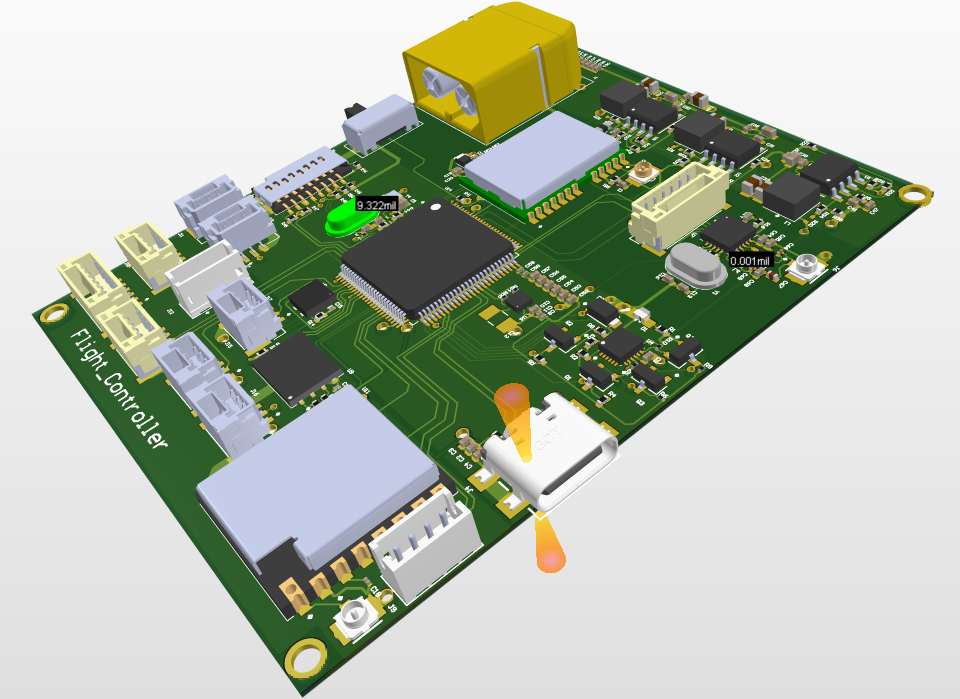

##### Drone Flight Controller

A basic custom flight controller designed in Altium Designer.

##### Overview

Includes schematic design, PCB layout, and custom component libraries.

##### Documentation 

[View Schematic PDF](Docs/flight_controller.pdf)

##### Screenshots

###### Schematic

###### 3D overview 

##### Files

PCB1.PcbDoc — PCB layout file

PcbLib.PcbLib — PCB footprint library

Schlib.SchLib — schematic symbol library

README.md — project description file

##### How to Open

Option 1 Download ZIP

* Click Code → Download ZIP on GitHub.
* Extract the ZIP file to a folder on your computer.
* Open the extracted folder.
* Open the .PrjPcb file in Altium Designer.

Note Do not open the project directly from inside the ZIP archive. Extract the files first.

Option 2 Clone Repository

* Clone the repository using GitHub Desktop or Git.
* After cloning, the project files will already be stored in a normal folder.
* Open the cloned folder.
* Open the .PrjPcb file in Altium Designer.

Status
---

Project status In development

##### Author

Araksya Harutyunyan

